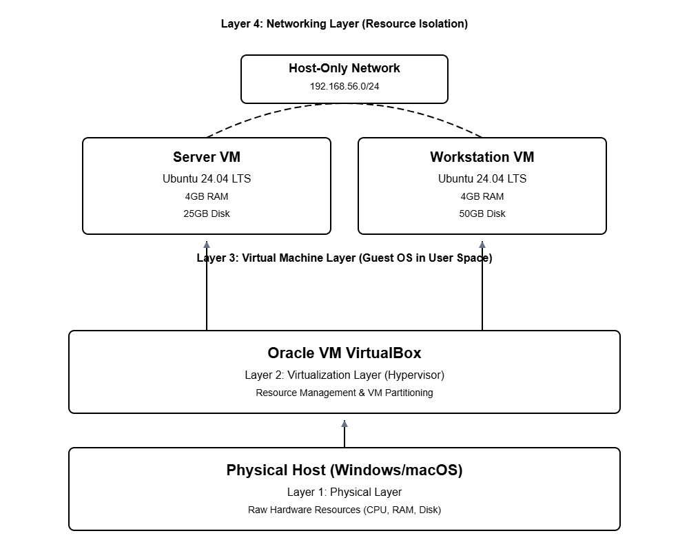

Week 1: System Planning and Distribution Selection
Phase 1: System Planning and Distribution Selection

This journal entry documents the planning and design of a virtualised operating system environment. The objective of this phase is to select appropriate Linux distributions, define system architecture, allocate resources efficiently, and configure a secure and isolated network environment suitable for experimentation and learning.

The environment is designed using Oracle VirtualBox and consists of two virtual machines:

A Server Virtual Machine

A Workstation Virtual Machine

1. System Architecture Overview

The system architecture consists of a single host machine running Oracle VirtualBox as a Type-2 hypervisor. Two guest virtual machines are deployed on top of the host system and connected using a Host-Only network adapter.

The Server VM hosts services and core system functions.

The Workstation VM acts as a client and administration system.

The Host-Only network enables secure inter-VM communication while preventing external internet access.

This layered architecture demonstrates operating system abstraction, resource sharing through virtualisation, and controlled network isolation.

Figure 1: System architecture diagram illustrating the host machine, VirtualBox hypervisor, Server VM, Workstation VM, and Host-Only network connection.

 

2. Distribution Selection Justification
Chosen Distribution: Ubuntu 22.04 LTS (Server VM)

Ubuntu 22.04 LTS was selected for the Server VM after comparing major Linux distribution families based on release model, stability, maintenance requirements, and package management.

Comparison of Linux Distribution Families
| Feature         | Debian Family (Ubuntu LTS) | Red Hat Family (RHEL, Fedora) | SUSE Family     | Arch Family |
|-----------------|----------------------------|-------------------------------|-----------------|-------------|
| Release Model   | Fixed (LTS)                | Fixed                         | Fixed / Rolling | Rolling     |
| Package Manager | APT                        | DNF / YUM                     | Zypper          | Pacman      |
| Stability       | High                       | High                          | High            | Low         |
| Maintenance     | Low                        | Medium                        | Medium          | High        |

Ubuntu 22.04 LTS provides long-term stability, predictable updates, and extensive community documentation, making it suitable for a server environment.

Justification

Stability and Security: Long-Term Support ensures consistent security updates.

Resource Management: Linux’s monolithic kernel with modular design provides efficient CPU, memory, and I/O management.

Sustainability: Efficient resource utilisation reduces energy consumption.

Community Support: Extensive documentation simplifies configuration and troubleshooting.

3. Workstation Configuration Decision
Operating System: Ubuntu (64-bit)

Ubuntu was selected for the Workstation VM to maintain consistency with the Server VM.

Justification:

Both systems belong to the Debian family and use APT, simplifying maintenance.

Ubuntu provides full access to GNU command-line utilities required for system navigation, monitoring, and administration.

The shared OS ecosystem reduces administrative complexity and learning overhead.

4. Resource Allocation and System Configuration
Memory Allocation

2048 MB RAM per VM

Provides sufficient physical memory to minimise swapping and maintain responsiveness.

Supports energy-efficient operation by avoiding over-allocation.

CPU Allocation

4 vCPUs per VM

Enables parallel execution and supports multi-threaded workloads.

Reduces the likelihood of CPU bottlenecks.

Storage Allocation

Workstation VM: 50 GB

Server VM: 25 GB

Storage is allocated based on expected workload, ensuring sufficient space for system files and future installations.

5. Network Configuration and Resource Isolation
Network Type: Host-Only Adapter

Both virtual machines are connected using a VirtualBox Host-Only network.

Network Properties:

Private subnet: 192.168.56.0/24

No external internet access

Secure inter-VM and host-to-VM communication

This configuration enhances security by isolating the lab environment from external threats while allowing controlled internal communication.

IP Addressing Scheme
| System | Role | IP Address | Interface |
|-------|------|------------|-----------|
| Server VM | Service host | 192.168.56.10 | enp0s3 |
| Workstation VM | Client / Admin | 192.168.56.11 | enp0s3 |

6. System Specification Documentation (CLI Evidence)

System specifications were gathered using standard Linux command-line utilities.

Server VM

uname -a – Confirms kernel version and architecture

lsb_release -a – Confirms Ubuntu LTS distribution

free -h – Shows memory usage and confirms efficient allocation

df -h – Displays file system usage

ip addr – Confirms network interface and IP configuration

Workstation VM

uname -a – Confirms GNU/Linux system

lsb_release -a – Confirms Ubuntu distribution

free -h – Shows higher memory usage expected for a client system

df -h – Confirms available storage

ip addr – Confirms correct network addressing

These commands demonstrate effective operating system resource management and configuration verification.

Conclusion

Week 1 focused on planning and designing a secure, efficient, and well-structured virtualised operating system environment. Through careful distribution selection, consistent workstation configuration, balanced resource allocation, and network isolation, the system establishes a strong foundation for security enforcement and performance monitoring in subsequent weeks.
 