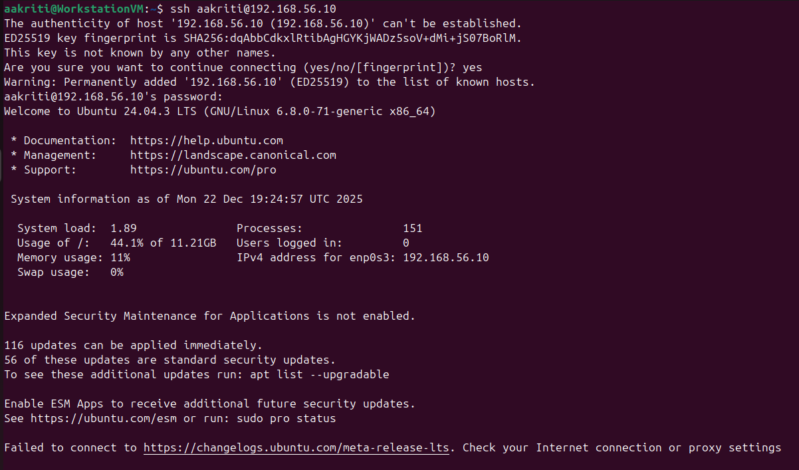
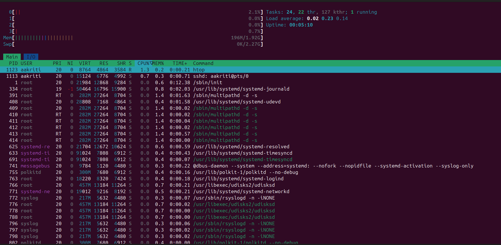
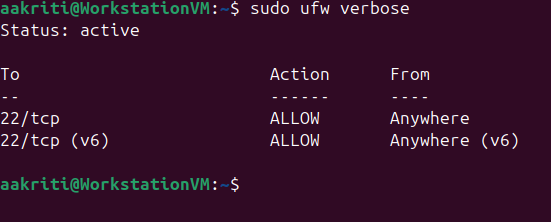

Week 2: Security Planning and Performance Testing Methodology
Phase 2: Security Planning and Testing Methodology

This journal entry documents the design and validation of a security baseline and a performance testing methodology for the virtualised operating system environment established in Week 1. The objective of this phase is to ensure that the Server Virtual Machine (VM) operates securely while supporting controlled remote performance monitoring from the Workstation VM.

Environment Overview

Server VM: Ubuntu Linux — 192.168.56.10

Workstation VM: Ubuntu Linux — 192.168.56.11

Network Configuration: VirtualBox Host-Only Adapter (isolated private network)

This configuration provides strong network isolation while allowing secure inter-VM communication.

1. Performance Testing Plan and Remote Monitoring
Purpose

The purpose of this performance testing plan is to evaluate CPU utilisation, memory usage, process behaviour, and system stability of the Server VM under normal operating conditions.

Remote Monitoring Methodology

Performance monitoring is conducted remotely from the Workstation VM using Secure Shell (SSH). This mirrors real-world system administration practices, where servers are managed remotely rather than through direct console access.

Tools Used
| Tool           | Purpose                                     |
| -------------- | ------------------------------------------- |
| `top` / `htop` | Real-time CPU and process monitoring        |
| `free -h`      | Physical and swap memory analysis           |
| `ps aux`       | Process identification and PID verification |
| `df -h`        | Disk usage and filesystem monitoring        |

Testing Approach

Establish a secure SSH session from the Workstation VM to the Server VM

Monitor CPU usage during idle operation

Observe memory consumption and verify minimal swap usage

Identify potential system bottlenecks

Confirm stable and responsive system behaviour

Key Performance Indicators (KPIs)
| KPI                 | Description                              |
| ------------------- | ---------------------------------------- |
| CPU Utilisation     | Percentage of CPU usage during operation |
| Memory Availability | Amount of free physical memory           |
| Swap Usage          | Indicates memory pressure                |
| Process Count       | Number of active processes               |
| Disk Usage          | Available filesystem space               |

Figure 1: Secure SSH Connection

Figure 1: Successful SSH connection from the Workstation VM to the Server VM (192.168.56.10), confirming encrypted remote administration access.

Figure 2: Real-Time Performance Monitoring Using htop

Figure 2: Real-time performance monitoring using htop over an active SSH session. The output shows low CPU utilisation, stable memory usage, and no swap activity, indicating efficient resource allocation and absence of performance bottlenecks.

2. Security Configuration Checklist

A security baseline was implemented on the Server VM to minimise the attack surface and enforce controlled administrative access.
| Security Area             | Status      | Technical Justification                            |
| ------------------------- | ----------- | -------------------------------------------------- |
| SSH Access                | Enabled     | Provides encrypted remote administration           |
| Firewall (UFW)            | Active      | Default deny policy with SSH explicitly allowed    |
| Mandatory Access Control  | Active      | AppArmor restricts process actions at kernel level |
| Automatic Updates         | Enabled     | Reduces exposure to known vulnerabilities          |
| User Privilege Management | Enforced    | `sudo` enforces least-privilege access             |
| Network Isolation         | Implemented | Host-only network prevents external exposure       |

Figure 3: Firewall Status Verification (UFW)

Figure 3: UFW firewall status showing an active firewall configuration with SSH (port 22) explicitly allowed, enforcing secure network access control.

3. Threat Model and Mitigation Strategies

The following threat model identifies realistic security threats relevant to the virtualised server environment and outlines appropriate mitigation strategies.
| Threat                          | Risk Description                    | Mitigation Strategy                        |
| ------------------------------- | ----------------------------------- | ------------------------------------------ |
| Unauthorised SSH access         | Potential system compromise         | Firewall rules and controlled user access  |
| Malware or compromised packages | Loss of system integrity            | Automatic updates and trusted repositories |
| Network-based attacks           | Service disruption or data exposure | Host-only network isolation                |

Conclusion

Week 2 focused on establishing a secure and manageable server environment supported by a structured performance testing methodology. Secure remote access via SSH, active firewall enforcement, mandatory access control, and network isolation collectively strengthen the system’s security posture. Performance monitoring confirms efficient resource utilisation and provides a reliable baseline for detecting abnormal behaviour in future system operations.