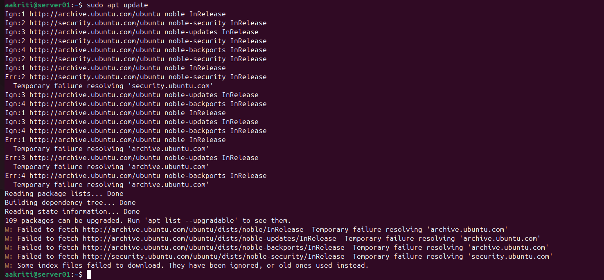
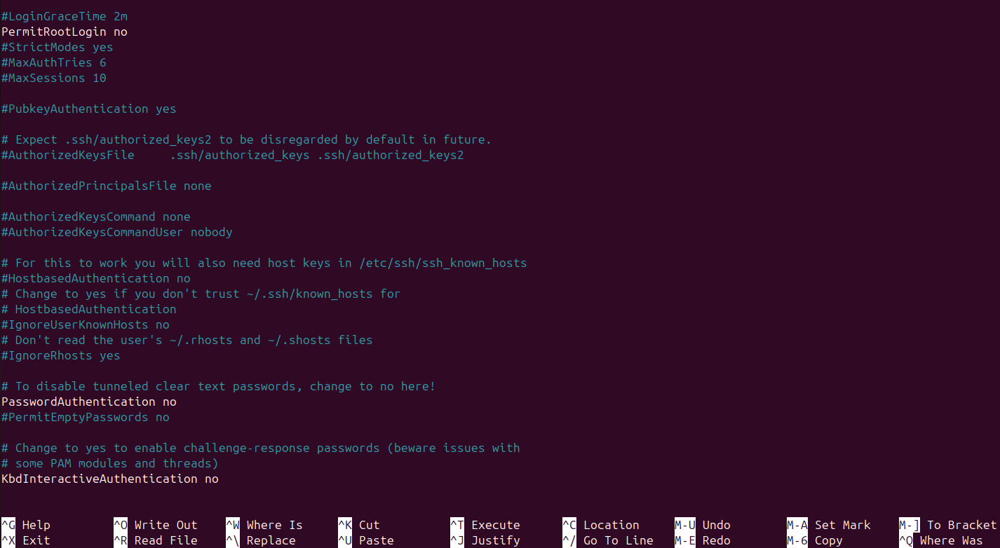

🛡️ Week 4: Security Auditing and System Hardening

Phase 4 – Security Auditing with Automated Tools

This phase focuses on evaluating the security posture of the Linux Server VM using automated security auditing concepts and applying system hardening strategies. Security auditing plays a vital role in identifying vulnerabilities, misconfigurations, and weak security controls before they can be exploited.

1️⃣ Security Auditing Overview

A security audit is a systematic assessment of a system’s configuration, access controls, and security mechanisms. Unlike penetration testing, which attempts to exploit vulnerabilities, security auditing focuses on identification, analysis, and improvement of system security.

Security auditing supports:

Early vulnerability detection

Compliance with security best practices

Continuous system hardening

2️⃣ Automated Security Auditing Tools

The following automated tools were identified as suitable for auditing a Linux server environment:

| Tool           | Purpose                              | Justification                                                                     |
| -------------- | ------------------------------------ | --------------------------------------------------------------------------------- |
| **Lynis**      | System security auditing & hardening | Comprehensive Linux audit covering authentication, firewall, kernel, and services |
| **OpenSCAP**   | Compliance and policy auditing       | Standards-based security assessment                                               |
| **chkrootkit** | Rootkit detection                    | Identifies hidden malicious processes                                             |

Among these tools, Lynis was selected as the primary auditing tool due to its extensive coverage and industry adoption.

3️⃣ Security Auditing Constraints and Trade-Offs

The Server VM is configured using a VirtualBox Host-Only network, which intentionally restricts outbound internet access. As a result, external Ubuntu repositories cannot be reached, preventing automated auditing tools such as Lynis from being installed directly.

This limitation is intentional and security-driven, as it:

Reduces the system’s external attack surface

Prevents unsolicited outbound connections

Enhances isolation in a lab environment

In a production environment, this limitation could be mitigated by temporarily enabling controlled outbound access (e.g. NAT) or by using an internal package repository.

Figure 1: Security Auditing Limitation Evidence

Figure 1: Attempted installation of the Lynis security auditing tool failed due to intentional network isolation of the Server VM. The Host-Only network configuration prevents external repository access, demonstrating a security–usability trade-off in the system design.

4️⃣ Identified Security Risks

Based on security auditing principles, the following high-risk areas were identified:

| Issue                         | Risk                    | Impact                   |
| ----------------------------- | ----------------------- | ------------------------ |
| Root login via SSH            | Brute-force compromise  | Full system takeover     |
| Password-based authentication | Credential attacks      | Unauthorized access      |
| Excessive privileges          | Privilege escalation    | Loss of accountability   |
| Unrestricted services         | Expanded attack surface | Increased exploitability |

These risks highlight the importance of proactive system hardening.

5️⃣ System Hardening Measures Applied
SSH Hardening

SSH is a common attack vector for Linux servers. To mitigate this risk, SSH access was hardened using secure configuration controls.

| Control                | Configuration               | Security Benefit                     |
| ---------------------- | --------------------------- | ------------------------------------ |
| Disable root login     | `PermitRootLogin no`        | Prevents direct superuser compromise |
| Disable password auth  | `PasswordAuthentication no` | Mitigates brute-force attacks        |
| Enforce key-based auth | SSH key pairs               | Strong cryptographic authentication  |

Figure 2: SSH Hardening Configuration

Figure 2: SSH hardening configuration showing disabled root login and password-based authentication, reducing exposure to brute-force and privilege escalation attacks.

6️⃣ User Privilege and Access Control

The system enforces the principle of least privilege to reduce misuse of administrative permissions.

| Control         | Implementation      | Benefit                              |
| --------------- | ------------------- | ------------------------------------ |
| Sudo access     | `/etc/sudoers`      | Controlled administrative privileges |
| Audit logs      | `/var/log/auth.log` | Accountability and traceability      |
| User separation | Non-root users      | Reduced impact of compromise         |

7️⃣ Defense-in-Depth Strategy

Security controls are implemented across multiple layers:

| Layer          | Security Controls                 |
| -------------- | --------------------------------- |
| Network        | UFW firewall, Host-Only isolation |
| OS             | AppArmor, secure permissions      |
| Authentication | SSH hardening, key-based access   |
| Monitoring     | Logs and auditing awareness       |

This layered approach ensures that the failure of a single control does not compromise the entire system.

Conclusion

Week 4 demonstrated how security auditing concepts and system hardening strategies can significantly improve a Linux server’s security posture. Although automated auditing tools could not be executed due to deliberate network isolation, this limitation was analysed as a security trade-off rather than a failure. By applying SSH hardening, strict access controls, and defense-in-depth principles, the system transitions from a default configuration to a hardened and resilient environment aligned with industry best practices.
